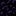

<div align="center">
  

  # 📦 Server Chest

  **Один серверный сундук — одно общее хранилище для всех игроков мира.**

  [](https://www.minecraft.net/)
  [](https://neoforged.net/)
  [](https://adoptium.net/)
  [](https://github.com/softboundless/ServerChest/actions/workflows/build.yml)
  [](LICENSE)

  [Возможности](#-возможности) • [Рецепт](#-рецепт) • [Установка](#-установка) • [Сборка](#сборка-из-исходников) • [Лицензия](#-лицензия)
</div>

## ✨ О моде

**Server Chest** добавляет серверный сундук на 27 слотов. Все установленные серверные сундуки в одном мире открывают одно и то же хранилище — независимо от игрока и измерения.

Предметы хранятся в данных мира и не пропадают, даже если сломать последний серверный сундук.

## 🧰 Возможности

- 🌍 общее хранилище на весь мир, доступное из любого измерения;
- 👥 единый инвентарь для всех игроков;
- 💾 сохранение содержимого независимо от установленных блоков;
- 🔒 доступ только через интерфейс игрока;
- 🚫 воронки, выбрасыватели, жёлобы и воронки из Create не могут перемещать предметы;
- 🔇 открытие без анимации крышки и без звука;
- 📚 окно на 27 слотов;
- 🧱 блок стакается по 64 штуки;
- 🌐 локализация на русский и английский языки.

## 🛠 Рецепт

| | | |
|:---:|:---:|:---:|
| Эндерняк | Эндерняк | Эндерняк |
| Обсидиан | Сундук | Обсидиан |
| Око Эндера | Эндер-сундук | Око Эндера |

<details>
<summary>Идентификаторы предметов</summary>

```text
EEE
OCO
YDY

E — minecraft:end_stone
O — minecraft:obsidian
C — minecraft:chest
Y — minecraft:ender_eye
D — minecraft:ender_chest
```

</details>

## 📥 Установка

### Требования

- **Minecraft:** 1.21.1
- **Mod Loader:** NeoForge 21.1.244 или более новая совместимая версия для Minecraft 1.21.1
- **Java:** 21

### Шаги

1. Установите NeoForge для Minecraft 1.21.1.
2. Скачайте JAR-файл мода со страницы [Releases](../../releases).
3. Поместите JAR-файл в папку `mods` на сервере **и у всех игроков**.
4. Запустите игру или сервер.

> [!IMPORTANT]
> Перед удалением мода перенесите ценные предметы из общего хранилища в обычный сундук. Всегда делайте резервную копию мира перед обновлением сборки.

## 🔌 Совместимость

### CoreProtectNeo

Мод совместим с проверкой контейнеров через `/co i` и откатом изменений инвентаря. История записывается на координаты конкретного серверного сундука, через который игрок открыл общее хранилище.

Поэтому проверка другого серверного сундука не объединяет всю историю. При одновременном просмотре хранилища несколькими игроками возможны пересекающиеся снимки — это ограничение позиционного журналирования единого серверного инвентаря.

### Автоматизация

Обычные воронки, выбрасыватели и совместимые системы автоматизации, включая воронки и жёлобы Create, не получают доступ к инвентарю. Предметы может перемещать только игрок через интерфейс сундука.

## 🧑‍💻 Для разработчиков

Проект основан на официальном [NeoForge MDK](https://github.com/neoforged/MDK) и использует ModDevGradle. Для разработки нужен JDK 21; отдельная установка Gradle не требуется.

### Сборка из исходников

Windows PowerShell:

```powershell
.\gradlew.bat build
.\gradlew.bat runClient
.\gradlew.bat runServer
```

Linux / macOS:

```bash
./gradlew build
./gradlew runClient
./gradlew runServer
```

Готовый файл появится в `build/libs/serverchest-1.0.0.jar`.

## 📄 Лицензия

Исходный код распространяется по пользовательской лицензии [Softboundless Mod License 1.0](LICENSE).

Она разрешает использование, изменение, публикацию, распространение и включение мода в сборки при соблюдении её условий. Обратите внимание: лицензия содержит отдельное ограничение для сторонних модпаков, в названии или основном брендинге которых используется **Freakland**, **Freak Land** или **Freak-Land**. Полный и юридически значимый текст находится в файле [LICENSE](LICENSE).

---

<div align="center">
  Сделано с 💚 для серверов Minecraft
</div>
